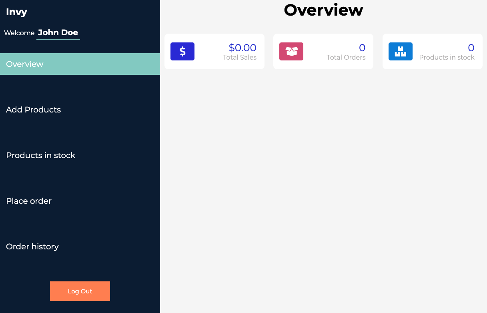
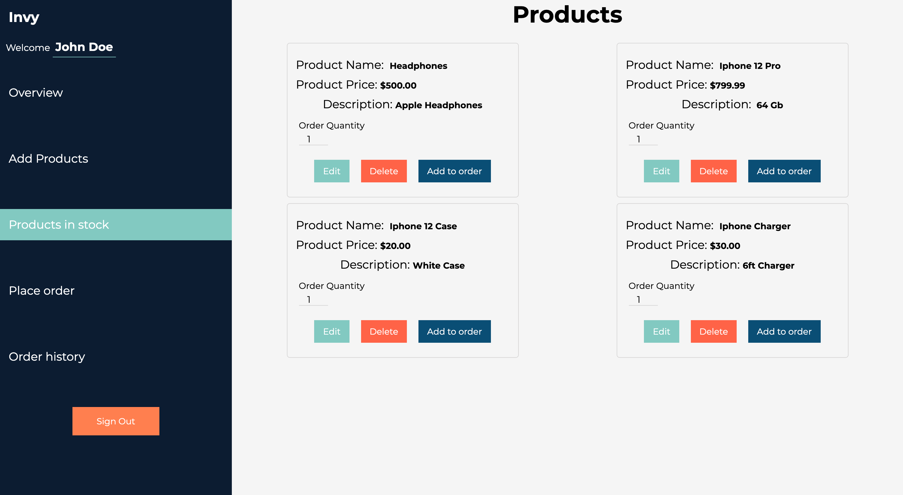
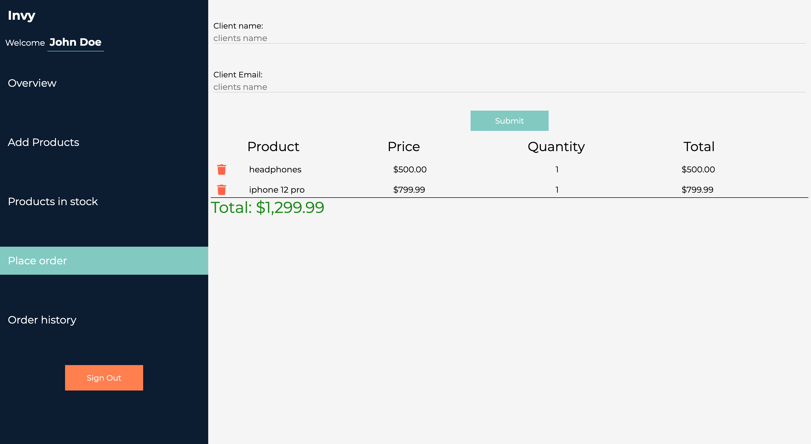

<h1 align="center">Inventory App</h1>

<h2 align="center">

</h2>

<p align="center">
  


</p>


<h2 align="center"><a  href="https://inventory-app-ui.vercel.app/">Live Demo</a></h2>

### [Contributions are Welcome](https://github.com/aneudya4/inventory-app-ui.git)

## Description

<p align="center">
</p>
Invy is a Inventory Mangagment app implemented with React, Node, Express and PostgresSQL. It will help the user to keep track of products in stock and sales.

## How Register

### Invy App Registration:

- **START** Click the Register button on the Navigation or on the banner.
- **Fill u and submit** Fill up the input box for Name,Email and Password.
- **Register** Click the Register button

<p align="center"></p>

### Invy App Demo Account:

- **START** Click the Login button on the Navigation or on the banner.
- **Demo** Click the Demo button

<p align="center"></p>

## About the project:

### Invy app:

- Invy app is implemented with React, Node, Express,Firebase for authentication and postgresSQL

### Mobile responsive:

<p align="center"></p>

### Overview:

User will see a Sumarry of the activities

<p align="center"></p>

### The Products page:

User will see a list of products added by themselves

<p align="center"></p>

### The Place order page:

User will see a list of products added by to be sold

<p align="center"></p>

### The Order history page:

User will see a list of past orders with details about the client

<p align="center"></p>

### The Add products page:

User will see a form to fill with information about the product to add.

<p align="center"></p>

### Project setup:

```bash
git clone https://github.com/aneudya4/inventory-app-ui.git
cd inventory-app-ui
npm install
npm run start
open http://localhost:3000
```

## NOTE:

- **issue with fetching** You will need to connect to a server, here is the repo for the local server

<h2 align="center"><a  href="https://github.com/aneudya4/inventory-app-server
">Local Server Repo</a></h2>

## Future scope:

- Adding a details view for past orders
- Mergin all orders placed by the same client
